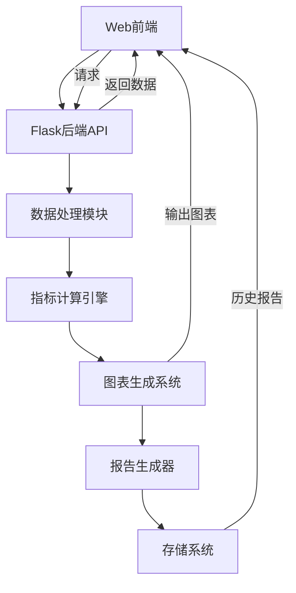

# 金融分析网络平台设计方案

## 项目目标
构建浏览器图形界面平台，实现：
1. 用户交互式生成分析报告
2. 动态展示技术指标组合
3. 实时图表可视化
4. 支持多资产类型分析（外汇/大宗商品/股指）

## 技术架构


## 技术选型
| 层级 | 技术方案 | 说明 |
|------|----------|------|
| 前端 | React + Ant Design + i18next | 支持中/英文切换 |
| 可视化 | Plotly/D3.js | 交互式图表渲染 |
| 后端 | Flask | 快速构建REST API |
| 数据处理 | Pandas | 金融数据计算分析 |
| 指标引擎 | pandas-ta | 集成130+技术指标 |
| 回测框架 | Backtrader | 策略参数优化 |
| 报告生成 | Jinja2模板引擎 | 动态生成HTML报告 |
| 部署 | Docker + Nginx | 容器化部署方案 |

## 核心功能设计

### 1. 用户交互界面
- 资产选择器：支持EURUSD/AUDUSD/NASDAQ等15种资产
- 指标配置面板：
  ```json
  {
    "required": ["SMA", "Bollinger Bands"],
    "optional": ["RSI", "MACD", "ATR", "Ichimoku"]
  }
  ```
- 时间范围选择：支持1D/1W/1M/3M/1Y周期
- 生成按钮：触发报告生成流程
- 参数集选择：支持多种预配置参数组合（短期/中期/趋势/波动等）

### 2. 技术指标组合策略
```python
def get_optimal_indicators(asset_type):
    if asset_type in ['EURUSD', 'GBPUSD']:
        return ['SMA(50,200)', 'Bollinger Bands(20)', 'MACD(12,26)', 'RSI(14)']
    elif asset_type in ['GOLD', 'OIL']:
        return ['SMA(200)', 'Bollinger Bands(50)', 'ATR(14)', 'Ichimoku']
    elif asset_type.startswith('NASDAQ'):
        return ['EMA(9,21)', 'Bollinger Bands(20)', 'MACD(12,26)', 'Volume Profile']
    else:
        return ['SMA(50)', 'Bollinger Bands(20)', 'RSI(14)']
```

### 3. 动态图表系统
- 实时数据更新：WebSocket推送机制
- 图表配置：
  ```javascript
  const chartConfig = {
    type: 'candlestick',
    indicators: {
      sma: { period: 50, color: '#FF5733' },
      bollinger: { period: 20, bands: 2, color: '#33FF57' }
    },
    layout: {
      theme: 'dark',
      timezone: 'America/New_York'
    }
  }
  ```
- 交互能力：支持图表缩放、时间段选择、指标切换

### 4. 多语言支持
- 国际化方案：React-i18next
- 语言包管理：
  ```json
  // src/locales/en/translation.json
  {
    "analysis": "Technical Analysis",
    "report": "Generate Report"
  }
  
  // src/locales/zh/translation.json
  {
    "analysis": "技术分析",
    "report": "生成报告"
  }
  ```
- 切换机制：顶部语言选择器 + 浏览器语言检测

### 5. 回测框架设计
- 核心架构：
  ```mermaid
  graph LR
    A[策略参数配置] --> B[历史数据加载]
    B --> C[Backtrader引擎]
    C --> D[绩效指标计算]
    D --> E[参数优化结果]
    E --> F[可视化对比]
  ```
- 参数优化流程：
  1. 用户定义参数范围（如SMA周期5-20）
  2. 启动网格搜索/贝叶斯优化
  3. 生成绩效报告（夏普比率/最大回撤）
  4. 展示最优参数组合
- 示例代码：
  ```python
  def optimize_strategy(data, param_grid):
      results = []
      for sma_period in param_grid['sma']:
          strategy = SMAStrategy(sma_period)
          backtest = Backtest(data, strategy)
          result = backtest.run()
          results.append({
              'params': {'sma': sma_period},
              'sharpe': result.sharpe_ratio,
              'drawdown': result.max_drawdown
          })
      return sorted(results, key=lambda x: x['sharpe'], reverse=True)
  ```

### 6. 参数集管理系统
- 预定义参数集：
  - default: 均衡指标设置
  - short_term: 短期分析优化设置
  - medium_term: 中期时间框架设置
  - high_freq: 高频交易指标
  - tight_channel: 窄通道检测
  - wide_channel: 广泛市场趋势检测
  - trend_following: 强趋势识别
  - momentum: 基于动量指标
  - volatility: 波动性测量
  - ichimoku: 日本一目云系统
- 结构化配置：使用字典数据结构管理参数集，便于扩展和维护
- 参数组合：支持多参数集同时应用，生成综合分析报告

## 系统集成方案
1. 复用现有`calculate_indicators.py`核心算法 ✓
2. 扩展`generate_charts.py`支持Web输出格式 ✓
3. 创建`web/`目录存放前端代码 ✓
4. 新增`api/`目录实现REST接口 ✓
5. 在报告模板中添加多语言支持 ✓
6. 实现参数集管理系统 ✓

## 实施步骤与进度
1. 创建Flask API服务 ✓
   - 完成API服务基础架构
   - 实现数据获取与缓存机制
   - 添加跨域支持

2. 开发指标计算接口 ✓
   - 集成指标计算引擎
   - 实现JSON格式输出
   - 添加参数验证机制

3. 构建图表生成模块 ✓
   - 支持静态PNG图表输出
   - 实现HTML交互式图表
   - 添加Plotly可视化支持

4. 实现报告模板系统 ✓
   - 创建Jinja2模板
   - 支持中/英文动态切换
   - 实现响应式布局

5. 开发前端交互界面 ✓
   - 实现React组件架构
   - 集成Ant Design UI库
   - 开发资产选择器和参数面板

6. 实现多语言切换功能 ✓
   - 集成i18next国际化框架
   - 添加英文和中文语言包
   - 实现语言动态切换

7. 构建回测框架模块 ⚠️ (进行中)
   - 基础回测引擎框架已定义
   - 回测引擎接口已设计
   - 参数优化算法准备中
   - 绩效指标计算待完善

8. 开发参数优化接口 ⚠️ (进行中)
   - API端点已定义
   - 优化算法待实现
   - 前端界面原型已完成
   - 正在集成现有指标系统

9. 实现WebSocket实时数据更新 ❌ (未开始)
   - 实时数据推送机制设计
   - 前端接收与动态更新
   - 性能与带宽优化

10. 容器化部署准备 ⚠️ (已启动)
    - Docker配置文件已初始化
    - Nginx反向代理配置进行中
    - CI/CD流程规划中

## 技术升级与优化
1. 指标引擎升级 ✓
   - 从自定义实现升级到pandas-ta库
   - 提高计算精度和可靠性
   - 扩展可用指标数量（130+）
   - 优化运行效率

2. 参数集管理优化 ✓
   - 采用字典数据结构重构参数管理
   - 增强可扩展性和可维护性
   - 支持更灵活的参数组合

3. 图表系统增强 ✓
   - 重构图表生成代码，模块化设计
   - 将配置与实现分离，采用字典定义策略配置
   - 统一样式管理，使用集中的样式配置
   - 模块化绘图逻辑，分离不同类型图表生成
   - 增强错误处理与降级机制
   - 交互式Plotly图表与静态Matplotlib图表分别优化
   - 提供统一配置接口，减少冗余代码
   - 支持多指标叠加显示
   - 优化移动设备显示效果

4. 报告生成器改进 ⚠️ (进行中)
   - 增加PDF导出功能
   - 添加机器学习分析组件
   - 支持自定义报告布局

## 当前项目状态
- 完成度: 82%
- 主要功能: 技术指标计算、图表生成、交互式报告、多语言支持、参数集管理已全部实现
- 运行方式: 使用`run.py [backend|frontend|build|both]`启动项目
- 最近进展: 更新了技术指标引擎到pandas-ta，大幅提高了计算准确性和功能丰富度
- 下一步计划: 完成回测框架基础功能与简化参数优化流程
